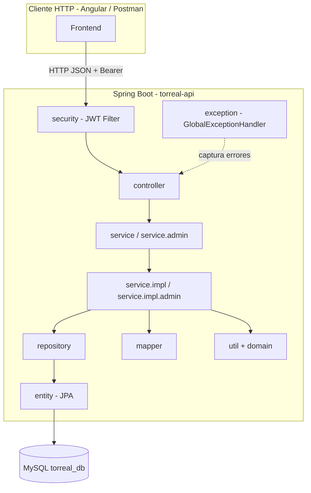
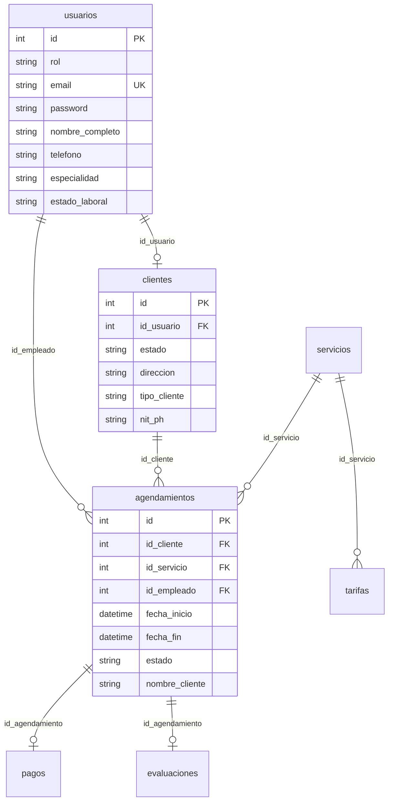
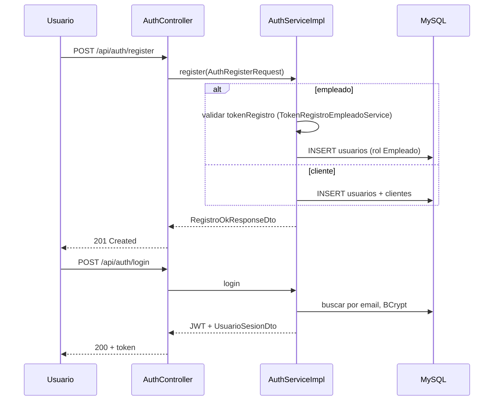

# Documentación del backend — Torreal API

API REST de **Torreal S.A.S**, desarrollada con **Spring Boot 3.4** y **Java 21**. Persiste datos en **MySQL** (`torreal_db`, puerto por defecto **3308**) y expone JSON en el puerto **8080**. El frontend Angular (`localhost:4200`) consume estos endpoints con autenticación **JWT** en rutas protegidas.

---

## 1. Visión general

El backend implementa la lógica de negocio de una plataforma de servicios (jardinería, aseo, mantenimiento, etc.) con tres tipos de usuario:

| Rol | Valor en BD / JWT | Acceso API |
|-----|-------------------|------------|
| Cliente | `Cliente` | `/api/cliente/**` |
| Empleado | `Empleado` | `/api/empleado/**` |
| Super usuario | `SuperUsuario` | `/api/admin/**` |

Además hay endpoints **públicos** (sin JWT): registro, login, servicios, novedades, postulaciones y salud.

### Arquitectura en capas



**Flujo típico de una petición protegida:**

1. `JwtAuthenticationFilter` lee `Authorization: Bearer <token>`.
2. Valida el token y comprueba que el **rol del token** coincida con el prefijo de la URL (`/api/cliente`, `/api/empleado`, `/api/admin`).
3. Guarda el usuario autenticado en `SecurityContext` (`TorrealAuthentication`).
4. El **controller** delega en un **service**.
5. El service usa **repositories** (JPA) y **utilidades** (validaciones, precios, estados).
6. La respuesta es un **DTO** (record Java) serializado a JSON.
7. Si hay error de negocio, se lanza `ApiBusinessException` y `GlobalExceptionHandler` devuelve `{"error": "mensaje"}`.

---

## 2. Configuración y arranque

| Archivo | Propósito |
|---------|-----------|
| `application.properties` | Puerto 8080, JDBC MySQL, JWT, CORS, carpeta `uploads` |
| `TorrealApiApplication.java` | Punto de entrada Spring Boot |
| `config/ApplicationBeansConfig.java` | Beans (p. ej. `PasswordEncoder` BCrypt) |
| `config/WebConfig.java` | Sirve archivos estáticos bajo `/uploads/**` |
| `config/JwtProperties`, `TorrealCorsProperties`, `TorrealUploadsProperties` | Propiedades tipadas |

Variables relevantes:

- `DB_HOST`, `DB_PORT` (default 3308), `DB_NAME`, `DB_USER`, `DB_PASSWORD`
- `JWT_SECRET`, `JWT_EXPIRES_DAYS` (default 7)
- `CORS_ORIGINS` (default `http://localhost:4200`)
- `TORREAL_UPLOADS_DIR` (default `./uploads`)

Comando habitual: `npm run api:java` desde la raíz del monorepo (ejecuta `mvn spring-boot:run` en `torreal-api`).

---

## 3. Base de datos — tablas

### 3.1 Resumen

| # | Tabla | ¿Usada por la API? | Entidad JPA |
|---|--------|-------------------|-------------|
| 1 | `usuarios` | Sí | `Usuario` |
| 2 | `clientes` | Sí | `Cliente` |
| 3 | `servicios` | Sí | `Servicio` |
| 4 | `tarifas` | Sí | `Tarifa` |
| 5 | `agendamientos` | Sí | `Agendamiento` |
| 6 | `postulaciones` | Sí | `Postulacion` |
| 7 | `novedades` | Sí | `Novedad` |
| 8 | `pagos` | No (solo modelo) | `Pago` |
| 9 | `evaluaciones` | No (solo modelo) | `Evaluacion` |
| — | `categorias` | No (entidad sin repositorio) | `Categoria` |

**Total en el script inicial (`database/init.sql`): 9 tablas.**  
**Total de entidades JPA en el proyecto: 11** (incluye `Categoria`, `Pago` y `Evaluacion` preparadas para futuras funciones).

El esquema evoluciona con migraciones en `database/*.sql` (columnas `estado` en clientes, `nombre_cliente` en agendamientos, rol `SuperUsuario`, etc.). Hibernate está en `ddl-auto=none`: **no** modifica el esquema automáticamente.

### 3.2 Modelo relacional (simplificado)



### 3.3 Tablas en detalle

#### `usuarios`
Cuenta única del sistema. Empleados y clientes son filas con distinto `rol`. El super usuario también es un registro aquí (`rol = 'SuperUsuario'`).

- Contraseñas con **BCrypt**.
- Empleados: `especialidad`, `estado_laboral` (`activo` / `inactivo`; la API también trata `"en servicio"` como activo).

#### `clientes`
Extensión 1:1 de un usuario con rol `Cliente`.

- `tipo_cliente`: Natural o Propiedad horizontal.
- `estado`: `activo` | `inactivo` — los inactivos **no pueden agendar**.
- `nit_ph`, `persona_contacto` para PH.

#### `servicios`
Catálogo (Jardinería, Aseo general, etc.).

#### `tarifas`
Precio por combinación **servicio + tipo_cliente** (Natural / Propiedad horizontal). El cobro en agendamiento se calcula **por hora** excluyendo 12:00–14:00 (`AgendamientoPrecioUtil`).

#### `agendamientos`
Reserva de un servicio.

- Columnas reales: `fecha_inicio`, `fecha_fin` (mapeadas en JPA como `fechaProgramada` / `fechaFinServicio`).
- `estado` en la instalación actual: valores como **`En Proceso`**, **`Cancelado`**, **`Finalizado`** (texto, no siempre el ENUM del `init.sql`).
- `nombre_cliente`: texto mostrado al empleado (puede ser nombre de PH).
- Asignación automática del primer empleado activo con especialidad compatible y sin solapamiento horario.

#### `postulaciones`
Formulario público de empleo (nombre, correo, PDF opcional en `uploads/cv/`).

#### `novedades`
Noticias/eventos para la web. Campos `imagen_url`, `tipo` (p. ej. `Noticia`). Imágenes en `uploads/novedades/`.

#### `pagos` y `evaluaciones`
Definidas en el ERD inicial; **aún sin endpoints ni servicios**. Previstas para pasarela de pago y valoraciones.

---

## 4. Paquetes del código (`com.torreal.api`)

Guía rápida (ver también `package-info.java`):

```
com.torreal.api/
├── TorrealApiApplication.java
├── config/           → beans, CORS, JWT props, uploads, WebMvc
├── controller/       → REST (8 controladores)
├── dto/              → contratos JSON entrada/salida (~25 clases/records)
├── entity/           → tablas JPA (11 entidades)
├── repository/       → Spring Data JPA (7 repositorios activos)
├── service/          → interfaces de negocio
│   ├── admin/        → subdominios del panel super usuario
│   └── impl/         → implementaciones
│       └── admin/    → AdminAgendamiento, AdminCuenta, AdminNovedad, AdminPostulacion
├── mapper/           → filas SQL / entidades → DTO
├── domain/           → RolUsuario, TorrealZonaHoraria
├── util/             → reglas reutilizables (estados, precios, fechas, NIT, archivos)
├── security/         → JWT, filtro, SecurityContext
└── exception/        → ApiBusinessException, manejador global
```

---

## 5. Capas en profundidad

### 5.1 `controller` — Capa REST

Responsabilidad: recibir HTTP, validar método/ruta, obtener el usuario del contexto (`TorrealSecurity.requireUsuario()`), llamar al service y devolver DTO o `ResponseEntity`.

| Controlador | Base | Autenticación |
|-------------|------|----------------|
| `HealthController` | `/api/health` | Pública |
| `AuthController` | `/api/auth` | Pública |
| `ServicioPublicoController` | `/api/servicios` | Pública |
| `NovedadPublicoController` | `/api/novedades` | Pública (GET) |
| `PostulacionController` | `/api/postulaciones` | Pública (POST multipart) |
| `ClienteController` | `/api/cliente` | JWT rol **Cliente** |
| `EmpleadoController` | `/api/empleado` | JWT rol **Empleado** |
| `AdminController` | `/api/admin` | JWT rol **SuperUsuario** |

No contienen lógica de negocio pesada; solo orquestación.

---

### 5.2 `dto` — Objetos de transferencia

Separan la API del modelo JPA. Casi todos son **`record`** inmutables (excepto `AuthRegisterRequest`, clase con getters/setters para el JSON de registro).

**Autenticación y sesión**

| DTO | Uso |
|-----|-----|
| `LoginRequestDto` | email, password |
| `LoginResponseDto` | token JWT + `UsuarioSesionDto` |
| `UsuarioSesionDto` | id, email, nombre, rol (para el front) |
| `AuthRegisterRequest` | registro empleado o cliente (+ `tokenRegistro` si empleado) |
| `RegistroOkResponseDto` | confirmación alta |
| `ErrorResponseDto` | `{"error": "..."}` uniforme |

**Cliente**

| DTO | Uso |
|-----|-----|
| `PerfilClienteResponseDto` | perfil, estado cuenta, lista de reservas |
| `AgendamientoClienteCardDto` | tarjeta de reserva en perfil |
| `TarifaClienteDto` | precios por servicio |
| `CrearAgendamientoRequest` | alta de reserva |
| `AgendamientoCreadoResponseDto` | id, empleado asignado, mensaje |

**Empleado**

| DTO | Uso |
|-----|-----|
| `PerfilEmpleadoResponseDto` | datos laborales + `activo` / `estadoCuenta` |
| `AgendamientoEmpleadoResponseDto` | evento de calendario por año |

**Admin**

| DTO | Uso |
|-----|-----|
| `AdminAgendamientoDto` | listado global de reservas |
| `AdminClienteDto` | clientes con métricas y estado |
| `AdminEmpleadoDto` | empleados con ocupación y estado |
| `AdminPostulacionDto` | CV recibidos |
| `NovedadPublicaDto` | novedades (también sitio público) |
| `CambiarEstadoRequest` | `{ "estado": "activo" \| "inactivo" }` |
| `TokenRegistroEmpleadoDto` | token 6 dígitos + segundos restantes |

**Otros**

| DTO | Uso |
|-----|-----|
| `ServicioPublicoDto` | catálogo público |
| `HealthResponseDto` | estado API + BD |
| `PostulacionCreatedResponseDto` | id postulación creada |

---

### 5.3 `entity` — Modelo JPA

Mapeo objeto-relacional con anotaciones Jakarta Persistence.

- Relaciones: `Cliente` → `Usuario`; `Agendamiento` → `Cliente`, `Servicio`, `Usuario` (empleado); `Tarifa` → `Servicio`.
- Nombres de columna explícitos cuando difieren del campo Java (p. ej. `fecha_inicio` ↔ `fechaProgramada`).
- `ddl-auto=none`: las entidades deben coincidir con el esquema real de MySQL.

Entidades **sin uso en servicios** hoy: `Pago`, `Evaluacion`, `Categoria`.

---

### 5.4 `repository` — Acceso a datos

Interfaces que extienden `JpaRepository<Entity, Long>`.

| Repositorio | Responsabilidad principal |
|-------------|---------------------------|
| `UsuarioRepository` | login por email, empleados por especialidad activos |
| `ClienteRepository` | cliente por `id_usuario`, listado con usuario (admin) |
| `ServicioRepository` | catálogo |
| `TarifaRepository` | precio por servicio y tipo de cliente |
| `AgendamientoRepository` | consultas nativas complejas (calendario, solapamientos, admin) |
| `PostulacionRepository` | listado ordenado por fecha |
| `NovedadRepository` | CRUD novedades |

Muchas consultas de agendamientos son **`@Query` nativas** porque unen varias tablas y devuelven `Object[]` convertidos por `NativeRowMapper` o clases `*Mapper`.

---

### 5.5 `service` — Lógica de negocio

Patrón **interfaz + implementación** en `service` / `service.impl`.

| Servicio | Descripción |
|----------|-------------|
| `AuthService` | login, registro empleado/cliente, validación token empleado |
| `TokenRegistroEmpleadoService` | código 6 dígitos, rota cada 3 minutos (memoria) |
| `ClientePerfilService` | perfil y reservas del cliente |
| `ClienteAgendamientoService` | crear/cancelar reservas, asignar empleado |
| `ClienteTarifaService` | tarifas según tipo de cliente |
| `ClienteAccesoService` | obtener/crear fila `clientes` para un usuario |
| `EmpleadoPerfilService` | perfil empleado |
| `EmpleadoAgendaService` | agendamientos por año (calendario) |
| `ServicioPublicoService` | listar servicios públicos |
| `NovedadPublicaService` | novedades para la landing |
| `PostulacionService` | guardar postulación + PDF |
| `HealthService` | ping y conexión BD |
| **`AdminService`** | **fachada** del panel admin |

**Subservicios admin** (`service.admin` + `service.impl.admin`):

| Servicio | Responsabilidad |
|----------|-----------------|
| `AdminAgendamientoQueryService` | listar todos los agendamientos |
| `AdminCuentaService` | clientes y empleados, cambio activo/inactivo |
| `AdminNovedadAdminService` | CRUD novedades + subida de imagen |
| `AdminPostulacionQueryService` | listar postulaciones |

`AdminServiceImpl` solo delega en estos cuatro; el `AdminController` no cambia.

---

### 5.6 `mapper` — Conversión a DTO

Clases `final` con métodos estáticos (sin Spring):

| Mapper | Función |
|--------|---------|
| `AgendamientoMapper` | fila SQL → `AgendamientoEmpleadoResponseDto` |
| `AdminAgendamientoMapper` | fila SQL → `AdminAgendamientoDto` |
| `NovedadMapper` | entidad `Novedad` → `NovedadPublicaDto` |

Evita duplicar `toLong` / `toInstant` en cada servicio; eso vive en `NativeRowMapper`.

---

### 5.7 `util` — Reglas transversales

| Utilidad | Función |
|----------|---------|
| `EstadoCuentaUtil` | normalizar y validar `activo`/`inactivo` (cliente y empleado) |
| `NativeRowMapper` | convertir columnas de consultas nativas |
| `UploadsPathUtil` | rutas `uploads/cv`, `uploads/novedades` |
| `AgendamientoFechasValidacion` | fechas futuras, orden inicio/fin |
| `AgendamientoCancelacionUtil` | regla 24 h para cancelar |
| `AgendamientoPrecioUtil` | total estimado por horas y tarifa |
| `HorarioAgendamiento` / `HorarioLaboralUtil` | franjas horarias permitidas |
| `ServicioEspecialidad` | mapeo servicio → especialidad del empleado |
| `TarifaTipoClienteUtil` | normalizar tipo para buscar tarifa |
| `RegistroValidacion` | especialidades y reglas de registro |
| `NitColombia` | validación NIT PH |

---

### 5.8 `domain` — Constantes de dominio

| Clase | Contenido |
|-------|-----------|
| `RolUsuario` | `EMPLEADO`, `CLIENTE`, `SUPER_USUARIO` + helpers |
| `TorrealZonaHoraria` | `America/Bogota` para todas las fechas mostradas al usuario |

---

### 5.9 `security` — Autenticación JWT

| Componente | Rol |
|------------|-----|
| `JwtService` | generar y validar token (userId, rol, expiración) |
| `JwtAuthenticationFilter` | filtro por ruta; exige Bearer y rol correcto |
| `TorrealAuthentication` | objeto en `SecurityContext` |
| `TorrealSecurity` | `requireUsuario()` en controllers |
| `SecurityConfiguration` | CORS, stateless, sin CSRF, filtro JWT |
| `JsonAuthenticationEntryPoint` | respuestas JSON en errores de Spring Security |

**Rutas que exigen JWT** (filtro):

- `/api/cliente/**` → token con rol `Cliente`
- `/api/empleado/**` → token con rol `Empleado`
- `/api/admin/**` → token con rol `SuperUsuario`

El resto de rutas `/api/**` son públicas a nivel Spring Security; la protección real la hace el filtro solo en esos prefijos.

---

### 5.10 `exception` — Manejo de errores

- **`ApiBusinessException`**: error esperado con `HttpStatus` (400, 403, 404, 409…) y mensaje en español para el usuario.
- **`GlobalExceptionHandler`** (`@RestControllerAdvice`):
  - `ApiBusinessException` → status + `ErrorResponseDto`
  - validación Bean Validation → 400
  - duplicado de email → 409
  - fallos JDBC / MySQL caído → 503 o 500 con mensaje genérico (sin filtrar detalles técnicos al cliente)

---

## 6. Catálogo de endpoints

Base URL: `http://localhost:8080`

Leyenda: **JWT** = header `Authorization: Bearer <token>`.

### 6.1 Salud y públicos

| Método | Ruta | Auth | Descripción |
|--------|------|------|-------------|
| GET | `/api/health` | — | Estado de la API y conexión a MySQL |
| GET | `/api/servicios` | — | Lista de servicios disponibles |
| GET | `/api/novedades` | — | Novedades publicadas |
| POST | `/api/postulaciones` | — | multipart: nombre, correo, cv (PDF) |

### 6.2 Autenticación (`AuthController`)

| Método | Ruta | Auth | Descripción |
|--------|------|------|-------------|
| POST | `/api/auth/register` | — | Alta empleado o cliente (empleado requiere `tokenRegistro`) |
| POST | `/api/auth/login` | — | Devuelve JWT + datos de sesión |
| GET | `/api/auth/login` | — | Ayuda: indica que login es POST |

### 6.3 Cliente (`ClienteController`)

| Método | Ruta | Auth | Descripción |
|--------|------|------|-------------|
| GET | `/api/cliente/mi-perfil` | JWT Cliente | Perfil, estado cuenta, reservas |
| GET | `/api/cliente/tarifas` | JWT Cliente | Precios por servicio |
| POST | `/api/cliente/agendamientos` | JWT Cliente | Crear reserva (asigna empleado) |
| POST | `/api/cliente/agendamientos/{id}/cancelar` | JWT Cliente | Cancelar si cumple regla 24 h |

### 6.4 Empleado (`EmpleadoController`)

| Método | Ruta | Auth | Descripción |
|--------|------|------|-------------|
| GET | `/api/empleado/mi-perfil` | JWT Empleado | Perfil y estado de cuenta |
| GET | `/api/empleado/mis-agendamientos?year=2026` | JWT Empleado | Calendario anual |

### 6.5 Admin (`AdminController`)

| Método | Ruta | Auth | Descripción |
|--------|------|------|-------------|
| GET | `/api/admin/token-registro-empleado` | JWT Super | Token 6 dígitos para registro de empleados |
| GET | `/api/admin/agendamientos` | JWT Super | Todas las reservas |
| GET | `/api/admin/clientes` | JWT Super | Clientes + métricas |
| PATCH | `/api/admin/clientes/{id}/estado` | JWT Super | activar/desactivar cliente |
| GET | `/api/admin/empleados` | JWT Super | Empleados + ocupación |
| PATCH | `/api/admin/empleados/{id}/estado` | JWT Super | activar/desactivar empleado |
| GET | `/api/admin/postulaciones` | JWT Super | Postulaciones recibidas |
| GET | `/api/admin/novedades` | JWT Super | Listar novedades |
| POST | `/api/admin/novedades` | JWT Super | multipart: título, contenido, imagen |
| DELETE | `/api/admin/novedades/{id}` | JWT Super | Eliminar novedad |

### 6.6 Archivos estáticos

| Ruta | Origen |
|------|--------|
| `/uploads/**` | Carpeta configurada (`torreal.uploads.dir`) |

---

## 7. Flujos de negocio principales

### 7.1 Registro e inicio de sesión



- **Empleado**: obligatorio `tokenRegistro` de 6 dígitos (lo muestra el super usuario en admin; caduca cada 3 minutos en servidor).
- **Cliente**: natural o propiedad horizontal; NIT validado si aplica (`NitColombia`).
- Tras login, el front guarda el JWT y lo envía en rutas `/api/cliente`, `/api/empleado` o `/api/admin` según el rol.

### 7.2 Agendar servicio (cliente)

1. Cliente autenticado y **activo** (`clientes.estado`).
2. `POST /api/cliente/agendamientos` con servicio, fechas, horas, dirección, etc.
3. Validación de fechas/horas (`AgendamientoFechasValidacion`, `HorarioAgendamiento`).
4. Se determina **especialidad** del servicio (`ServicioEspecialidad`).
5. Se buscan empleados **activos** con esa especialidad (`UsuarioRepository.findEmpleadosActivosPorEspecialidad`).
6. Se elige el primero **sin solapamiento** en el rango (`countSolapamientosEmpleado`).
7. Se persiste `agendamientos` con estado **`En Proceso`**, `nombre_cliente`, fechas en UTC/Instant.
8. Respuesta con nombre del empleado asignado.

Si no hay empleado disponible → **409 Conflict** con mensaje explicativo.

### 7.3 Cancelar reserva (cliente)

1. Solo el cliente dueño de la reserva.
2. `AgendamientoCancelacionUtil`: al menos **24 horas** antes del inicio y estado no cancelado.
3. Estado pasa a **`Cancelado`**.

### 7.4 Panel super usuario

- **Token empleado**: generado en memoria; no está en BD.
- **Clientes/empleados inactivos**: no agendan (cliente) o no se asignan en nuevas reservas (empleado en query de candidatos).
- **Novedades**: imagen obligatoria al crear; tipo fijado a `Noticia` en servicio.

### 7.5 Calendario empleado

- `GET /api/empleado/mis-agendamientos?year=YYYY`
- Consulta nativa por `id_empleado` y año de `fecha_inicio`.
- Nombre del cliente: `COALESCE(nombre_cliente en agendamiento, nombre del usuario cliente)`.

---

## 8. Reglas de negocio consolidadas

| Regla | Dónde se aplica |
|-------|-----------------|
| Cliente inactivo no agenda | `ClienteAgendamientoServiceImpl` + `EstadoCuentaUtil` |
| Empleado inactivo no se asigna | `UsuarioRepository` (solo activos) |
| Especialidad servicio ↔ empleado | `ServicioEspecialidad` |
| Sin doble reserva mismo empleado | `countSolapamientosEmpleado` |
| Cancelación ≥ 24 h antes | `AgendamientoCancelacionUtil` |
| Horario laboral y almuerzo 12–14 | `HorarioAgendamiento`, `AgendamientoPrecioUtil` |
| Token registro empleado 6 dígitos / 3 min | `TokenRegistroEmpleadoServiceImpl` |
| Contraseña BCrypt | `AuthServiceImpl` |
| Email único | BD + `DataIntegrityViolationException` → 409 |

---

## 9. Despliegue y operación

1. MySQL con `database/init.sql` + migraciones según el entorno.
2. Variables de entorno o `application.properties` para BD y JWT.
3. `mvn spring-boot:run` o `npm run api:java`.
4. Carpeta `uploads/` creada automáticamente para `cv` y `novedades`.

**Credencial de prueba super usuario** (si se aplicó `migrate_super_usuario.sql`):

- Email: `super@torreal.local`
- Contraseña: `Torreal@Super2026`

---

## 10. Extensión futura (código ya preparado)

- Tablas **`pagos`** y **`evaluaciones`** con entidades JPA listas.
- Entidad **`Categoria`** sin API.
- Pasarela de pago mencionada en el front del cliente (“próximamente”).
- Unificar estados de `agendamientos` en BD con los valores que usa el código (`En Proceso`, `Cancelado`, `Finalizado`).

---

*Documento generado para el proyecto Torreal_service — API `torreal-api`. Refleja el estado del código y el esquema documentado en `database/`.*
